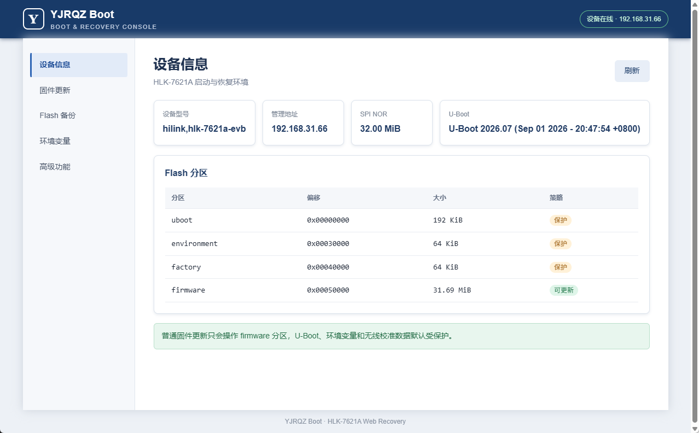

# HLK-7621A All Kit

HLK-7621A（MT7621）开发套件，包含 OpenWrt 24.10.8 和定制 U-Boot 2026.07。

## U-Boot

`u-boot-2026.07` 基于 [U-Boot v2026.07](https://github.com/u-boot/u-boot/releases/tag/v2026.07)，主要增加：

- `YJRQZ Boot` Web 恢复后台，默认地址 `192.168.31.66`。
- OpenWrt sysupgrade 镜像校验、刷写、回读验证和进度显示。
- SPI NOR 分区备份、环境变量管理及高级恢复功能。
- 启动菜单和物理恢复按键；菜单默认停留在 `0. Exit`。
- 普通固件更新默认保护 U-Boot、Environment 和 Factory 分区。



编译：

```bash
cd u-boot-2026.07
make O=build CROSS_COMPILE=mipsel-linux-gnu- olddefconfig
make O=build CROSS_COMPILE=mipsel-linux-gnu- -j$(nproc)
```

生成文件为 `u-boot-2026.07/build/u-boot-mt7621.bin`，大小不得超过 U-Boot 分区的 192 KiB。详细说明见 [WebFlash 设计文档](u-boot-2026.07/README.webflash.md)。
